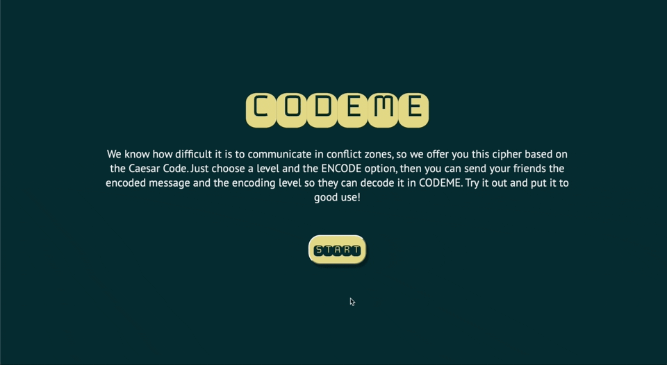

# PROJECT CIPHER

## Description

“Cipher” is a web application that allows the user to encrypt and decrypt a text message by indicating a specific character offset. 

**Subject**: Communication in the context of military or political conflict.

**Client**: People who need to communicate without being censored.

**Font**: Inknut Antiqua - Monofett - Jockey One

**Color Palette**: #062C30-#05595B-#E2D784-#F5F5F5F5

## Usage

