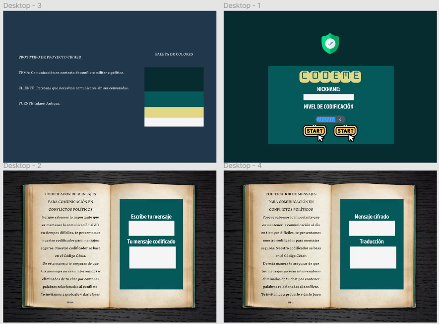

PROJECT CIPHER

INTRODUCCIÓN

TEMA: Comunicación en contexto de conflicto militar o político. 
CLIENTE: Personas que necesitan comunicarse sin ser censuradas.
FUENTE:Inknut Antiqua-Monofett-Jockey One
PALETA DE COLORES: #062C30-#05595B-#E2D784-#F5F5F5

PROTOTIPO

https://www.figma.com/file/lXXRZrl8nPbr51YvTe2bFc/CIPHER?node-id=0%3A1

DESCRIPCIÓN

Comenzamos con crear el prototipo después de asignar contexto.
Editamos readme con prototipo e introducción en una rama nueva.
Creamos branch para CSS y HTML.
Fijamos el fondo y estilo de box en CSS.
Agregamos en HTML título, input text para nombre, input range para nivel de codificación.
Completamos la primera pantalla y tuvimos office hour con Mauricio donde pedimos feedback del prototipo y resolvimos bloqueo sobre agregar pantallas.
Agregamos pantalla encode y decode y logramos hacer que cada botón de la pantalla principal lleve a su correspondiente html.
Hicimos merge con cambios de HTML, CSS Y README.
Pedimos OH con Mauricio donde nos ayudó a conectar la info del slide para el desplazamiento del cifrado y también poder unir el cifrado con el botón.
Logramos que el botón en cada pantalla se conecte con el cifrado encode y decode.
Actualizamos README y mergeamos una branch con el cifrado en ambas pantallas.
Para continuar pedimos feedback a Domi y también obtuvimos feedback de Dani y compañeras en el cierre del primer sprint.
Logramos agregar una pantalla de landing donde se recibe al usuario y se le da una breve descripción antes de que pueda comenzar a usar el cifrador.
Agregamos también un botón de copiar para llevar el mensaje codificado al decodificador o viceversa.
Cambiamos de lugar los botones encode y decode para que se encuentren bajo el texto que inserta el usuario y hacer la interfaz más amigable e intuitiva.
Agregamos cifrado y descifrado para números, añadiendolos al conjunto de cipher.js
Modificamos el diseño en css para que todo quedara en su sitio.
Añadimos el icono de pestaña.
Logramos añadir un alert para avisar al usuario cuando la caja de texto está vacía y no hay nada que codificar.
